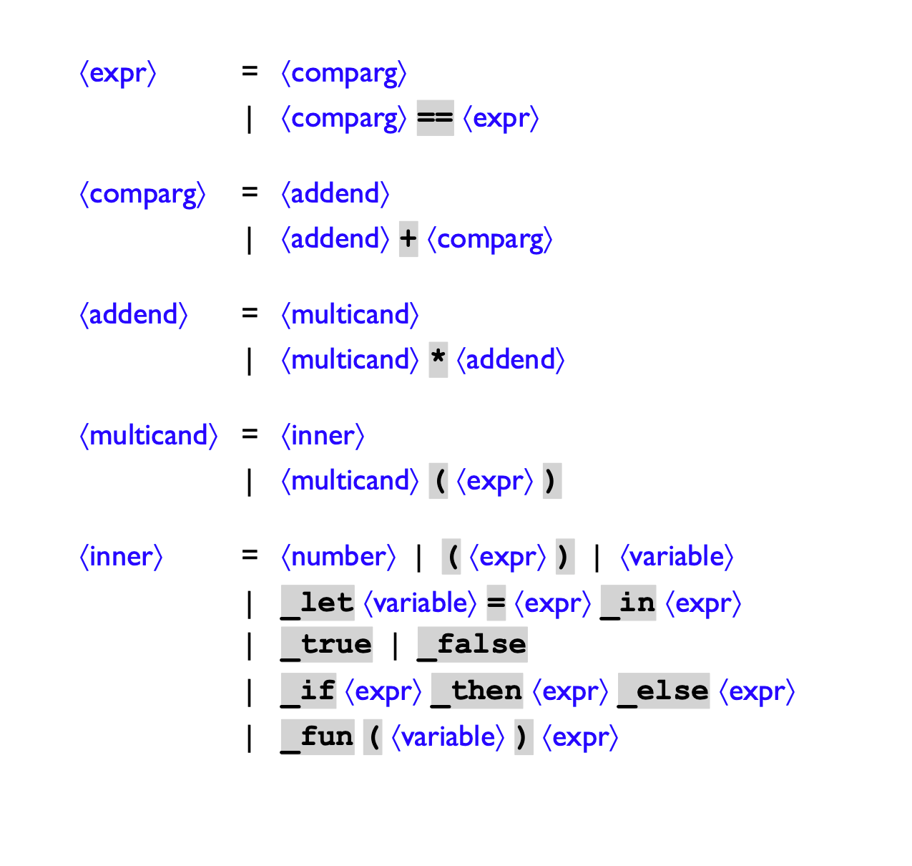

https://guides.github.com/pdfs/markdown-cheatsheet-online.pdf

# MSDScript Overview

* MSDScript is an interpreter used to evaluate mathematical expressions. The user can input expressions via the command
  line or they can read expressions from an external file. MSDScript will then parse the expression and execute based on
  the given mode.
    * MSDScript can print input expressions in two ways, with parentheses around each subexpression or parentheses only
      where needed to keep correct association.
    * It can also interpret mathematical expressions in two ways using the stack or updating global variables in order
      to avoid stack overflow.
    * User input comes from a file path or std::cin. User enters a mathematical expression (see example expression below) 
      via command line, and MSDScript processes the expression in accordance to the flag passed. 
    * Variables can be bound in two ways. Using a function expression or using Let Expression:
        * Let expressions bind numbers to variables, which can then be interpreted. e.g. _let x = 15 _in x * 2 => 30
        * Function expressions are similar to Let expressions except that any number can later be passed. e.g
          _fun(x) x * 2. This expression can later be called _fun(15) => 30. To nest these you can pass them in a let expression
        * Nesting a Function expression within a Let expression is a way to define, then call a Function. e.g _let f = _fun(x) x+ 1 _in f(3)
    

* Examples:
    * User bind variables using Let expressions. e.g. _let x = 3 in x + 1.
    * User write functions to be interpreted
      _fun(x) x + 1, _fun(3)
    * Addition 3 + 5
    * Multiplication 3 * 5

    * Flags:
        * --help -this lists all possible commands
        * --test -runs all associated tests
        * --esc -escapes out of running MSDScript program
        * --interp \<file path\> -interprets mathematical which is parsed from the given file path
        * --interp -interprets from user input, using std::cin
        * --print \<file path\> -prints specified expression from parsed from specific file
        * --print -prints specified expression from parsed user input std::cin
        * --pretty-print \<file path\> --prints specified expression from specific file without unnecessary parenthesis
          and with proper spacing
        * --pretty-print --prints specified expression user input std::cin without unnecessary parenthesis and with
          proper spacing
        * --step \<file path\> -interprets mathematical which is parsed from the given file path. This interprets
          without building stack frames, allowing for massive recursion.
        * --step -interprets from user input, using std::cin This interprets without building stack frames, allowing for
          massive recursion.

# Building MSDScript

Building MSDScript Using make file:

* Provided is a make file.
* On command line you can run make. This will compile and generate .o files and .exe files.
* ./msdscript \<flag\> <filePath\> will run the program parsing expression from a specified file path
* ./msdscript \<flag\> will run the program. User input then be provided in terminal via std::cin.

Linking MSDScript to another Implementation:

* You can generate all .o files using make command along with the provided makefile
* create an image using the following command (excluding main)
    * ar -ruv image.a CommandLine.o Expr.o Test.o Parser.o Val.o Env.o Cont.o Step.o
* compile and link your program with the library using the following command
    * c++ -std=c++14 -O2 -o programName file_to_link.cpp <\filePath to image>

# MSDScript (The language spec)

## Classes:

### __Expr (Expression Class)__

- Representation of different mathematical expressions SubClasses:
    * NumExpr - Object representation of a Mathematical _Numerical_ Expression e.g. "5"
    * AddExpr - Object representation of a Mathematical _Addition_ Expression e.g. "1+2"
    * MultExpr - Object representation of a Mathematical _Multiplication_ Expression e.g. "2*3"
    * VarExpr - Object representation of a Mathematical _Variable_ Expression e.g. "x"
    * LetExpr - Object representation of a Mathematical Binding e.g. "x = 3 in: x +1"
    * BoolExpr - Object representation of a _true of false_ condition e.g. "7 is a prime number  (true), a dog is a
      mammal (true)"
    * EqualExpr - Object representation of a _comparison_ Expression e.g. "1 == 1, 1 == 2"
    * IfExpr - Object representation if a _evaluation_ Expressions based of a _boolean_ condition e.g.
      "_if (true) _then 5 _else 6 --> 5"
    * FunExpr - Object representation of a _function_ Expression e.g. "_fun (x) x + 1"
    * CallExpr - Object representation _Function being called_ e.g.  "_fun(10) --> 11"

* __*Methods:*__
    * void to_string() - returns string representation of the expression
    * void to_string_pretty() - returns string representation of the expression with proper spacing and parenthesis
    * void print_to_console() - helper method to print expression to console
    * void petty_print() - prints expression with proper spacing and parenthesis
    * bool equals(Expr *e) - returns weather the argument expression is equivalent to the the caller
    * Val* interp() - returns the interpreted value of the expression
    * bool has_variable - returns weather or not any part of the expression contains a variable
    * void print(std::ostream &out_stream) - prints specified expression to the stream passed
    * std::string to_string_pretty() - returns string representation of pretty-printed expression.
    * void step_interp() - interprets expression by updating global variables. Done to limit recursive calls from
      overflowing stack space.

### __Cont (Continue Class)__

- Specifies the work left to be done to evaluate the expression while running StepInterp.
    * ContDone - Object representation that indicates there is no more work to do in order to evaluate a given
      expression
    * RightThenAddCont - Object representation of work to be done. The next step is to interpret the right side of the
      expression, then add the interpreted left-hand-side to interpreted -right-hand-side
    * AddCont - The final step of an addition expressions. Has a left hand value that is added to the right hand side
      value.
    * MultCont - Similar to AddCont, except used in a multiplication expression rather than addition.
    * RightThenMultCont - Similar to RightThenAddCont except specifies that Multiplication in the future
    * IfBranchCont - Continuations for if statements and their evaluations. Specifies work to be done. Holds Expressions
      for both the If condition and the else conditions
    * LetBodyCont - Holds the work left to be done while evaluating a Let statement. Work to be done includes binding of
      variables to values.
    * ArgThenCallCont - Continuation used the evaluation of Functions. Holds the actual argument, and the next steps, in
      evaluating that argument.
    * CallCont - Similar to MultCont & AddCont- species actually calling the functions, and interpreting. Specifies the
      work left to be done is to call the actual function.
    * RightThenCompCont - Specifies that the work to be done in a comparison expression. Need to evaluate the
      right-hand-side, and compare the left-hand-side to the right-hand-side.
    * CompCont - The final step in evaluating a comparison expression. Compare the evaluated right-hand-side and the
      evaluated left-hand-side.

* __*Methods:*__
    * void step_continue() - update global registers to appropriate values.
    * bool equals(Cont * other) - returns whether the passed Cont is equal to the caller Cont.

### __Env (Environment Class)__

- holds the binding of variables passed through recursive evaluation process. "Sticky notes" to hold associated
  variables and their values.
    * ExtendedEnv - Representation of nested environments. Holds the bindings of its current expression, along with a
      link to nested expression environments.
    * EmptyEnv - Representation of a environment without any bindings.

* __*Methods:*__
    * Val* lookup(std::string find_name) - looks in implicit environment for find_name passed. if found returns a value
      bound to that variable
    * bool equals(Env *other) - return whether or not the passed Env is equivalent to the implicit Env

### __Val (Value Class)__

- holds representation of values. Numbers, Booleans, Functions
    * NumVal - Object representation of a Numerical Value
    * BoolVal - Object representation of a Boolean Value
    * FunVal - Object representation of a Function Value

### __Parser__

- Recursive parser that parses input and returns appropriate expression, or throws an error with invalid put

* __*Methods:*__

- Methods are used to parse user input.
    * static PTR(Expr)parse_expr(std::istream &in) - First call to parse any input expression
    * static PTR(Expr)parse_num(std::istream &in) - Parses numbers and returns a NumExpr
    * static void consume(std::istream &in, int expect) -Consume characters, if the input does not match expected throws
      and error
    * static void skip_whitespace(std::istream &in) - function used to handle white space within any given expression
    * static PTR(Expr)parse_addend(std::istream &in)  - parses addend
    * static PTR(Expr)parse_multicand(std::istream &in) - parses multicand
    * static PTR(Expr)parse_inner(std::istream &in); - parses inner
    * static PTR(Expr)parse_let(std::istream &in) - Function used to parse LetExpr
    * static PTR(Expr)parse_keyword(std::istream &in) - If '_' is found, this expression parses a specific keyword and
      returns appropriate expression
    * static PTR(FunExpr)parse_fun(std::istream &in) - Parses user input and returns FunExpr
    * static PTR(VarExpr)parse_var(std::istream &in) - Parses user input and returns VarExpr
    * static PTR(Expr)parse_string(const std::string &string) - Used to parse String input and return the appropriate
      expression
    * static PTR(Expr)parse_comparg(std::istream &in) - parses comparison argument
    * static PTR(Expr)parse_if_statement(std::istream &in) - Parses user input and returns IfExpr
    * static PTR(Expr)createExpressionFromKeyword(std::string &keyword, std::istream &in) -Container method for all
      expression parser. Views keyword and returns appropriate expression

Figure 1.1

Figure 1.1 Describes the grammar of MSDScript. An expression is either a comparison argument, or and comparison argument
and and expression. Comparison argument is either an addend or and Addened + a Comparision argument. A Muliticand is
either an inner, and a multiplication of an expression. An inner is any sort of expression that is nested within
another.

# Potential Errors

Please report any issues with MSDScript to github issue page.
https://github.com/Captain-Kirkie/Captain-Kirkie-MSDscript/issues

  
    

          

          
        
  
